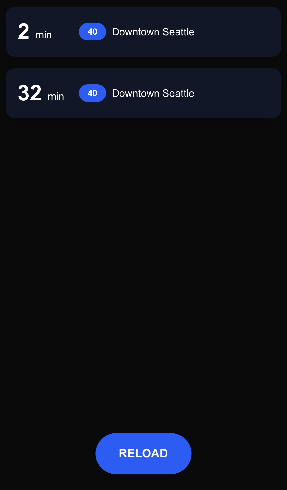

## Transit App
Transit App is an easy way for commuters to see when their bus or train arrives. Implementation is in Next.js (React) and uses the OneBusAway API. Below is a demonstration of the working web app.

<p align="center">
  
</p>

## Getting Started

Begin by applying for a OneBusAway API Key. Add this to your .env file. 

Next, find your nearest bus stops by putting in the latitude and longitude for your bus stop in the following API: `https://api.pugetsound.onebusaway.org/api/where/stops-for-location.json?key={YOUR_KEY}&lat={LAT}&lon={LONG}` Put your stop id in the .env file. 

Next run `npm install` to install all node modules.

Finally, run the development server:

```bash
npm run dev
```

Open [http://localhost:3000](http://localhost:3000) with your browser to see the result.
